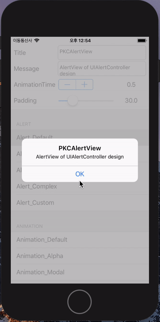
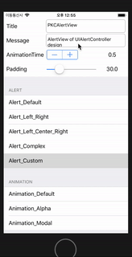

# PKCAlertView

[](https://travis-ci.org/pikachu987/PKCAlertView)
[](http://cocoapods.org/pods/PKCAlertView)
[](http://cocoapods.org/pods/PKCAlertView)
[](http://cocoapods.org/pods/PKCAlertView)

## Example




To run the example project, clone the repo, and run `pod install` from the Example directory first.

<br><br>

####SImple Example


~~~~

import PKCAlertView
let alertView = PKCAlertView("Title", message: "Message", bgColor: UIColor(red: 170/255, green: 170/255, blue: 170/255, alpha: 0.8), padding: 70)
alertView.addAlertButton("Default") { (type, text) in }
alertView.show()

~~~~

<br><br>


#### Complex Example

~~~~~

import PKCAlertView

let alertView = PKCAlertView("Title", message: "Message", bgColor: UIColor(red: 170/255, green: 170/255, blue: 170/255, alpha: 0.8), padding: 70)

alertView.addAlertButton("Default") { (type, text) in }
alertView.addAlertView("OK") { (type, text) in }
alertView.addAlertView("Cancel", rightText: "OK") { (type, text) in }
alertView.addAlertView("Left", centerText: "Center", rightText: "Right", handler: { (type, text) in })

let pkcAlertButton = PKCAlertButton("CustomButton")
pkcAlertButton.addTarget(self, action: #selector(self.defaultAction(_:)), for: .touchUpInside)
pkcAlertButton.titleLabel?.font = UIFont.boldSystemFont(ofSize: 19)
pkcAlertButton.backgroundColor = UIColor(red: 240/255, green: 240/255, blue: 240/255, alpha: 1)
pkcAlertButton.highlightColor = UIColor(red: 210/255, green: 210/255, blue: 210/255, alpha: 1)

alertView.addAlertButton(pkcAlertButton, handler: { (type, text) in })

let pkcAlertButton1 = PKCAlertButton("CustomLeftButton")
let pkcAlertButton2 = PKCAlertButton("CustomRightButton")
alertView.addAlertButton(pkcAlertButton1, rightButton: pkcAlertButton2, handler: { (type, text) in })

let pkcAlertButton3 = PKCAlertButton("CustomLeftButton")
let pkcAlertButton4 = PKCAlertButton("CustomCenterButton")
let pkcAlertButton5 = PKCAlertButton("CustomRightButton")
alertView.addAlertButton(pkcAlertButton3, centerButton: pkcAlertButton4, rightButton: pkcAlertButton5, handler: { (type, text) in })

alertView.animationType = .default
alertView.animationType = .alpha
alertView.animationType = .modal
alertView.animationTime = TimeInterval(0.5)

alertView.show()

~~~~~

## Installation

PKCAlertView is available through [CocoaPods](http://cocoapods.org). To install
it, simply add the following line to your Podfile:

```ruby
pod "PKCAlertView"
```

## Author

pikachu987, pikachu77769@gmail.com

## License

PKCAlertView is available under the MIT license. See the LICENSE file for more info.
